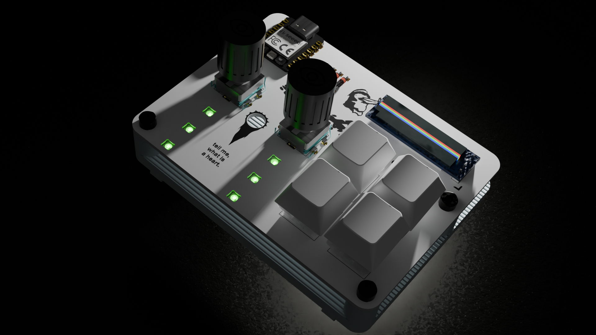
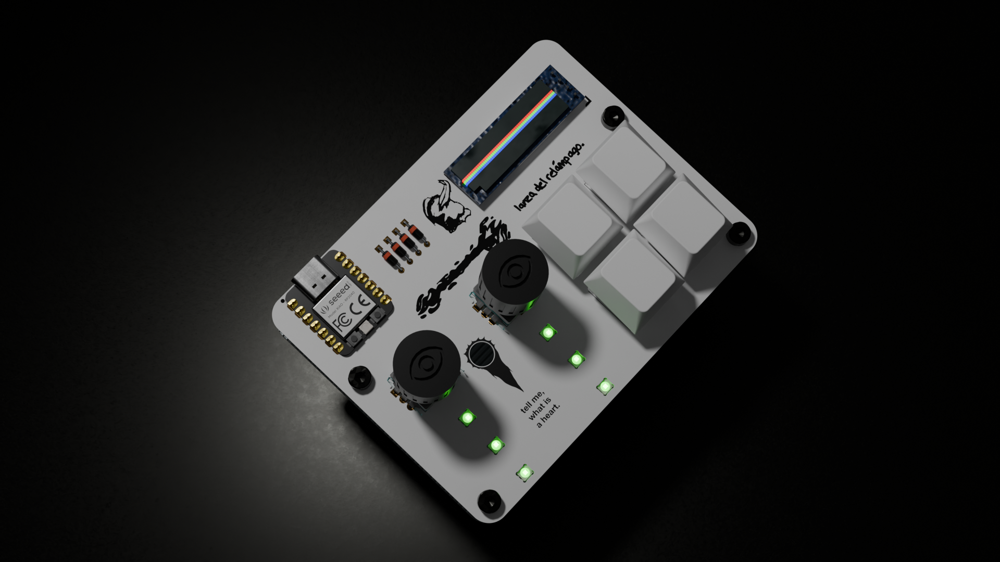
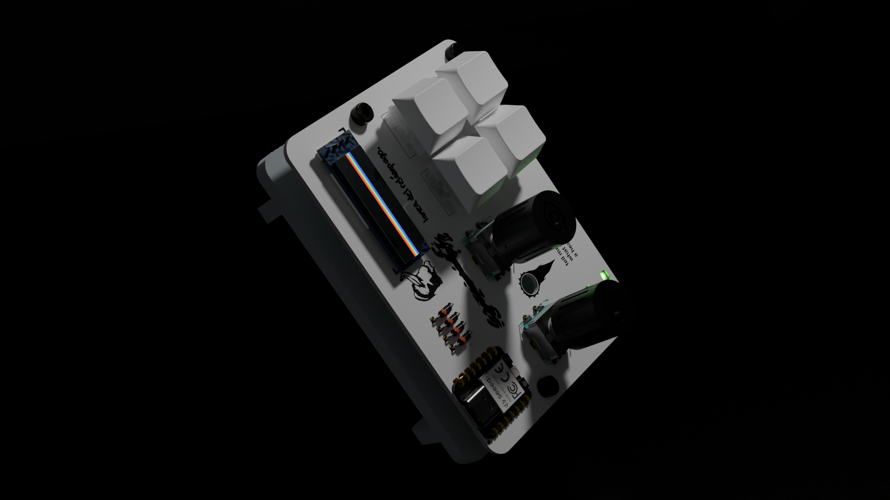
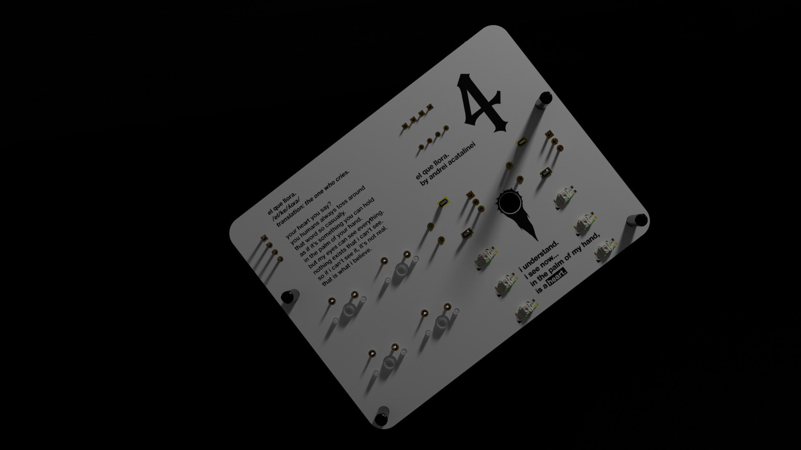
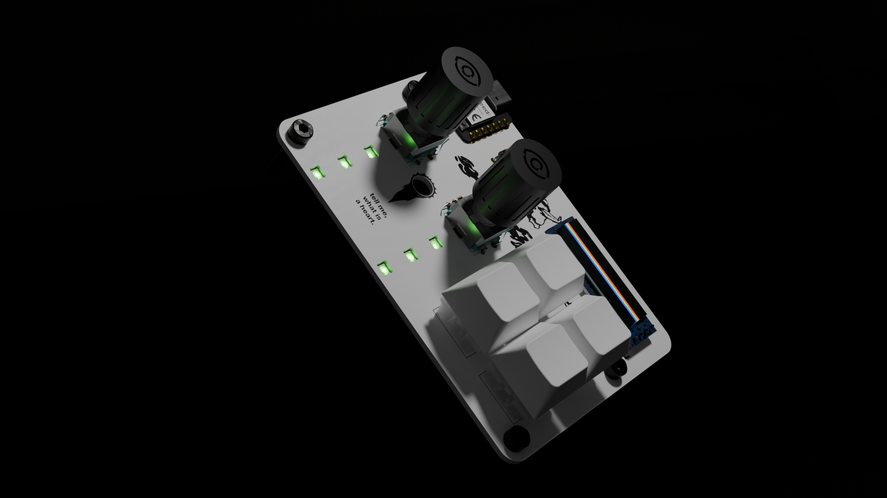

<h3 align="center">
<picture>
  <source media="(prefers-color-scheme: dark)" srcset="images/elquellora_title_white.png">
  <source media="(prefers-color-scheme: light)" srcset="images/elquellora_title_black.png">
  
</picture> 
<picture>
  <source media="(prefers-color-scheme: dark)" srcset="images/author_white.png">
  <source media="(prefers-color-scheme: light)" srcset="images/author_black.png">
  
</picture>
 
a lil hackpad based off the design of ulquiorra from bleach! 
designed for stardance, hack club. 
 

    
  
  
  
  
  
  

<h3 align="left">get started.</h3>
<h4 align="left">
<a href="instructions.md">click here</a> to go to the instructions on how to get started!
</h4>

<h3 align="left">about the board.</h3>
<h4 align="left">
el que llora is a 4 key hackpad with pcb art made by me, 
designed with inspiration and quotes from 
ulquiorra cifer from bleach! 
 
i wanted to make a project based off of bleach for a while 
(you can probably tell by my other project <a href="https://github.com/lycronisxd/peroxide">peroxide</a>) 
but finally thought of a design that would look cool in practice, so here we are!
</h4>

<h3 align="left">features of the board.</h3>
<h4 align="left">
<ul>
<li>xiao rp2040 based</li>
<li>0.91 inch oled display</li>
<li>4x mechanical keys</li>
<li>2x ec11 rotary encoders</li>
<li>6x sk6812mini-e leds (not per-key rgb though)</li>
<li>custom bleach-inspired pcb art</li>
<li>bare-pcb design</li>
</ul>
</h4>

<h3 align="left">design images.</h3>
<h4 align="center">
 
 
 
 
 
 

</h4>

<h3 align="left">bill of materials.</h3>

|item no.|part no.|part name                 |qty.|supplier    |unit cost|total cost|notes                                            |
|--------|--------|--------------------------|----|------------|---------|----------|-------------------------------------------------|
|1       |PCB-001 |elquellora pcb            |5   |jlcpcb      | $0.40   | $7.19    |$2 for 5 pcbs + $5.12 for shipping               |
|2       |PCB-002 |seeed studio xiao rp2040  |1   |hack club   |N/A      |N/A       |provided in hackpad kit                          |
|3       |PCB-003 |1n4148 diodes             |4   |hack club   |N/A      |N/A       |provided in hackpad kit                          |
|4       |PCB-004 |0.91 inch oled            |1   |hack club   |N/A      |N/A       |provided in hackpad kit                          |
|5       |PCB-005 |ec11 rotary encoders      |2   |hack club   |N/A      |N/A       |provided in hackpad kit                          |
|6       |PCB-006 |sk6812 mini-e leds        |6   |hack club   |N/A      |N/A       |provided in hackpad kit                          |
|7       |PCB-007 |mx style switches         |4   |hack club   |N/A      |N/A       |provided in hackpad kit                          |
|8       |3D-001  |m3x5mmx4mm heatset inserts|4   |hack club   |N/A      |N/A       |provided in hackpad kit                          |
|9       |3D-002  |m3x16mm screws            |4   |hack club   |N/A      |N/A       |provided in hackpad kit                          |
|10      |3D-003  |3d printed case           |1   |print legion|?        |?         |will update when receiving a quote from a printer|
|11      |3D-004  |3d printed encoder knobs  |2   |print legion|?        |?         |will update when receiving a quote from a printer|

<h3 align="left">my other stuff.</h3>
<h4 align="left">
a custom rp2040 dev board, <a href="https://github.com/lycronisxd/peroxide">peroxide</a> 
 
an 18 key, per key rgb macropad with an oled screen, <a href="https://github.com/lycronisxd/pentoxide">pentoxide</a> 
 
a custom sim-racing shifter, <a href="https://github.com/lycronisxd/a-shift">a-shift</a> 
 
a custome corexy 3d printer, <a href="https://github.com/lycronisxd/https://github.com/lycronisxd/polylactic">polylactic</a> 
 
a handwired split mechanical keyboard, <a href="https://github.com/lycronisxd/e-split">e-split</a>
</h4>
